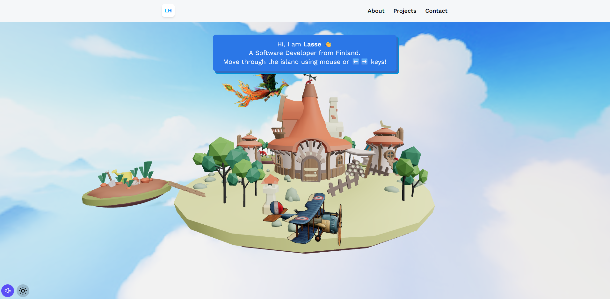
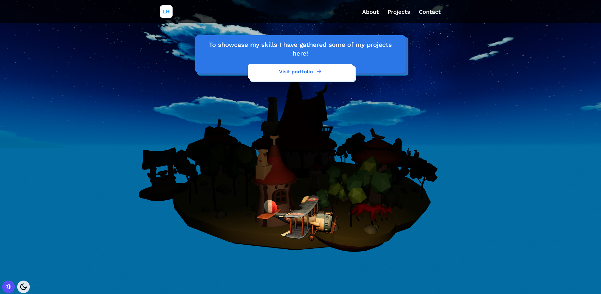
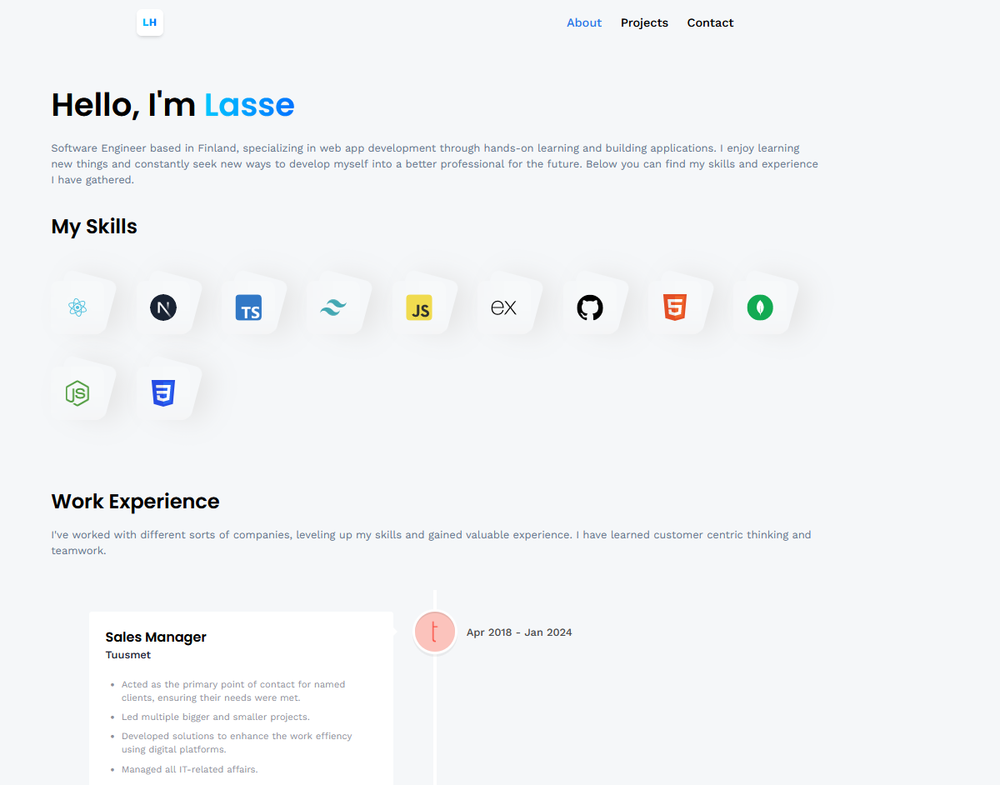
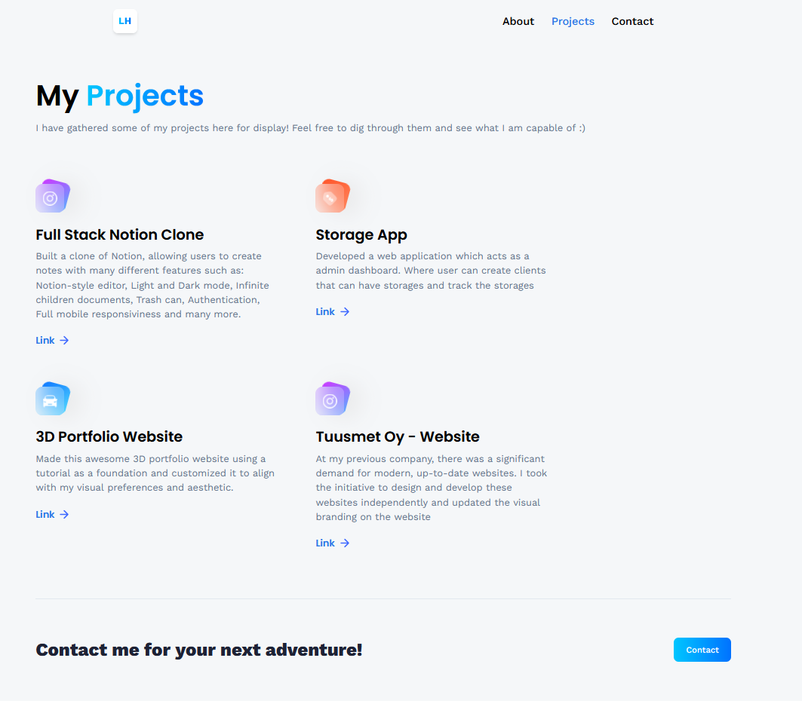
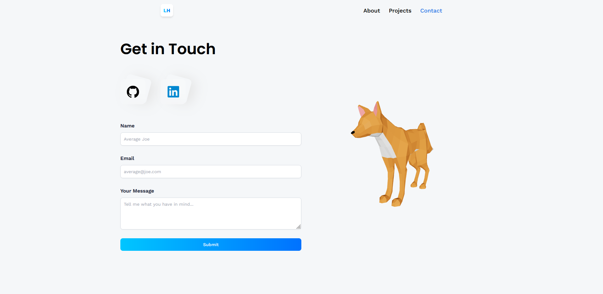

# Project Name
> This is a Notion like note taking app.

> Live demo [_here_](https://noteapp-jebbis.vercel.app/). <!-- If you have the project hosted somewhere, include the link here. -->

## Table of Contents
* [General Info](#general-information)
* [Technologies Used](#technologies-used)
* [Features](#features)
* [Screenshots](#screenshots)
* [Setup](#setup)
* [Usage](#usage)
* [Project Status](#project-status)
* [Room for Improvement](#room-for-improvement)
* [Acknowledgements](#acknowledgements)
* [Contact](#contact)
<!-- * [License](#license) -->


## General Information
- The aim of this project was to learn new skills and how to structure a bigger project
<!-- You don't have to answer all the questions - just the ones relevant to your project. -->


## Technologies Used
- Next.JS - version 13.5.4
- Typescript - version 5.0
- Tailwind CSS - version 3.0
- Edge Store - version 0.1.4
- Clerk - version 4.26.3
- Convex - version 1.6.2


## Features
List the ready features here:
- Real-time database
- Notion-style editor
- Light and Dark mode 
- Infinite children documents
- Trash can & soft delete
- Authentication
- File upload
- File deletion
- File replacement 
- Icons for each document (changes in real-time)
- Expandable sidebar
- Full mobile responsiveness
- Publish your note for sharing
- Fully collapsable sidebar
- Landing page
- Cover image of each document
- Recover deleted files


## Screenshots





<!-- add img folder to root where readme file is located  -->


## Setup
To run this project you need Convex, Clerk and Edge Store accounts and setup environments to get secret keys

Cloning the repository `git clone https://github.com/Jebbis/Notion.git`

Install dependecies `npm i`

Setup .env.local file 
```
CONVEX_DEPLOYMENT=
NEXT_PUBLIC_CONVEX_URL=
NEXT_PUBLIC_CLERK_PUBLISHABLE_KEY=
CLERK_SECRET_KEY=
EDGE_STORE_ACCESS_KEY=
EDGE_STORE_SECRET_KEY=
```

Start Convex `npx convex dev`

Start the app `npm run dev`


## Usage
How does one go about using it?
Provide various use cases and code examples here.

`write-your-code-here`


## Project Status
Project is:  _complete_


## Room for Improvement

Further development:
- Create more custom editor stylings


## Acknowledgements
- This project was based on [this tutorial](https://www.youtube.com/watch?v=0OaDyjB9Ib8).
  

## Contact
Discord - lasse0


<!-- Optional -->
<!-- ## License -->
<!-- This project is open source and available under the [... License](). -->

<!-- You don't have to include all sections - just the one's relevant to your project -->
